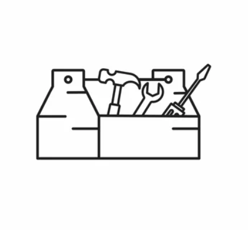

  

  <h1 align="center">Toolbox</h1>

  

        A Collection of terminal oriented utilities written in Go that
        contribute to my ideal Personalized Development
        Environment
  

## Tools

### Git
* [add-repo](./app/addRepo/README.md)
* [audt-dir](./app/auditDir/README.md)

### Misc
* [print-path](./app/printPath/README.md)
* [print-environ](./app/printEnviron/README.md)

## Usage
I opted for one catch all 'toolbox' binary with namespaced
organization within simply to make my life easier when deploying.

Since typing 'toolbox git add-repo <blah>' is tedious, I
recommend creating shell aliases for your most used tools. I do
something like [this](https://github.com/Ajlow2000/nixos/commit/3735cdf6c40f1b0f91aea80168c07dbd4e5c2c85)
