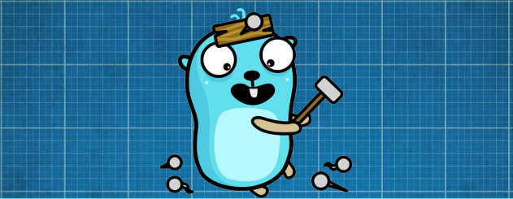

  

  <h1 align="center">Toolbox</h1>

  

        A Collection of terminal oriented utilities written in Go that
        contribute to my ideal Personalized Development Environment
  

## Tools

| Collection | Tool Name | Linux Support | Windows Support |
| ---------- | --------- | ------------- | --------------- |
| git        | [`add-repo`](./app/git/addRepo/README.md) | - [ ] | - [ ] |
| git        | [`audt-dir`](./app/git/auditDir/README.md) | - [ ] | - [ ] |
| misc       | [`print-path`](./app/misc/printPath/README.md) | - [ ] | - [ ] |
| misc       | [`print-environ`](./app/misc/printEnviron/README.md) | - [ ] | - [ ] |
